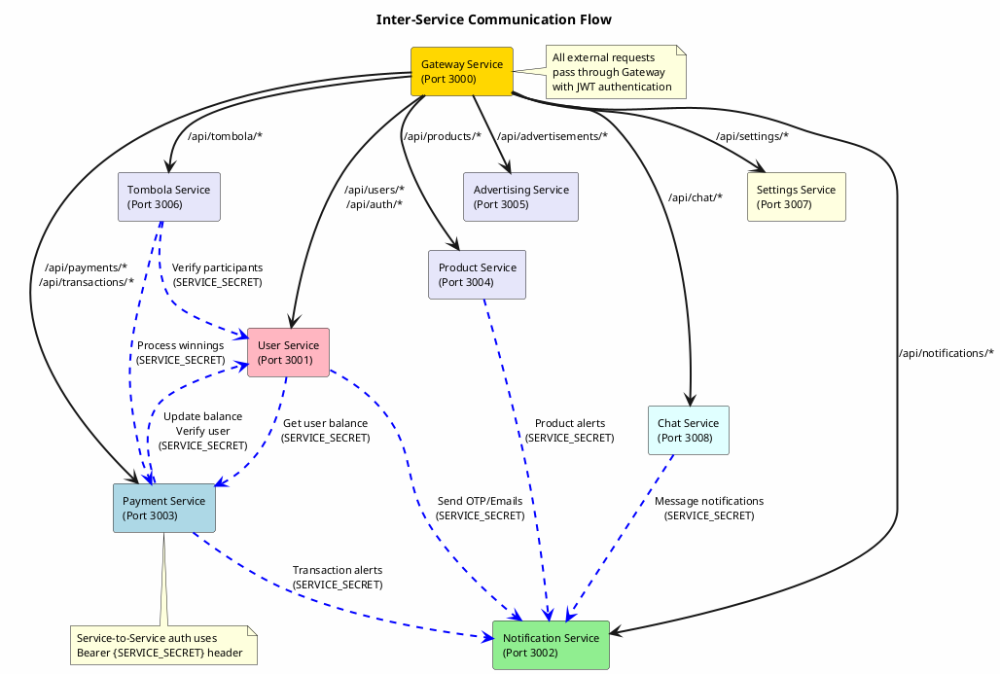
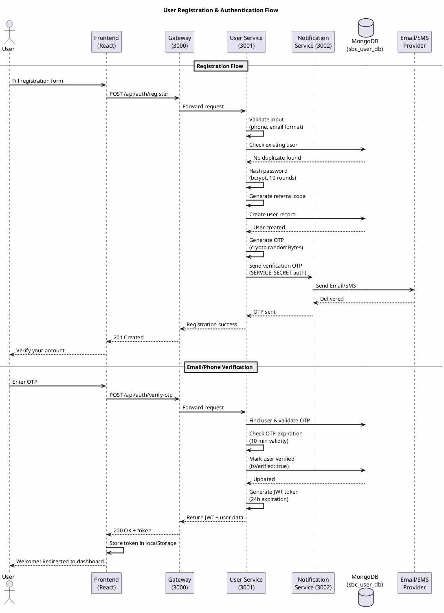
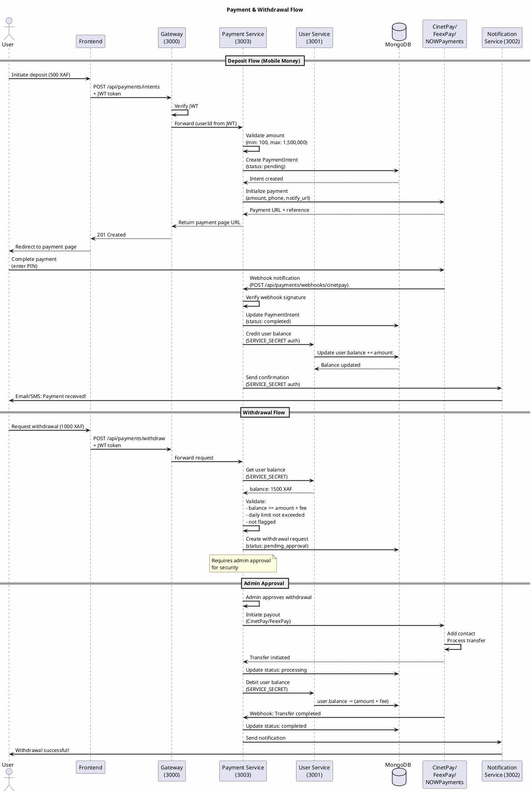
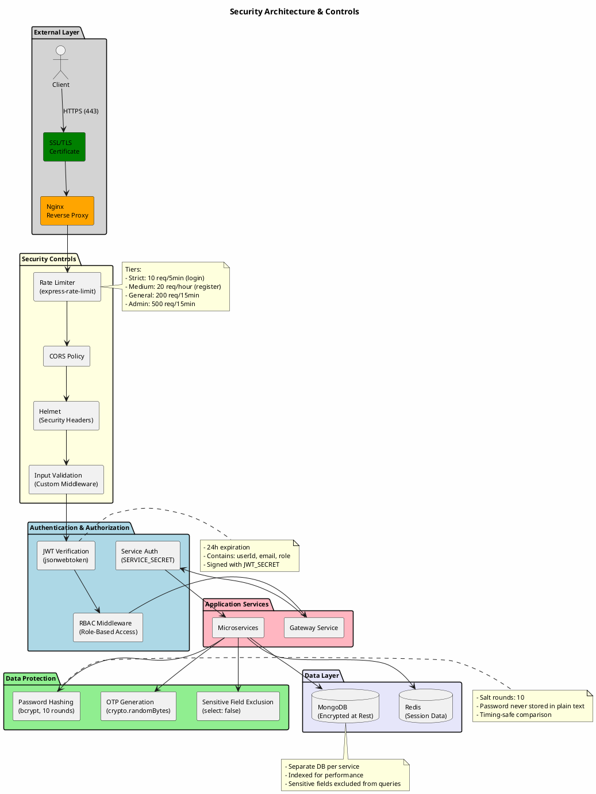
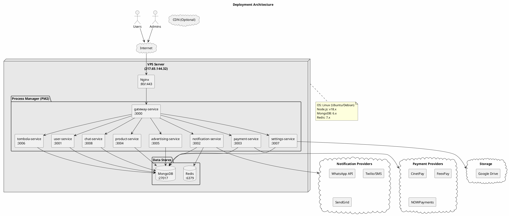
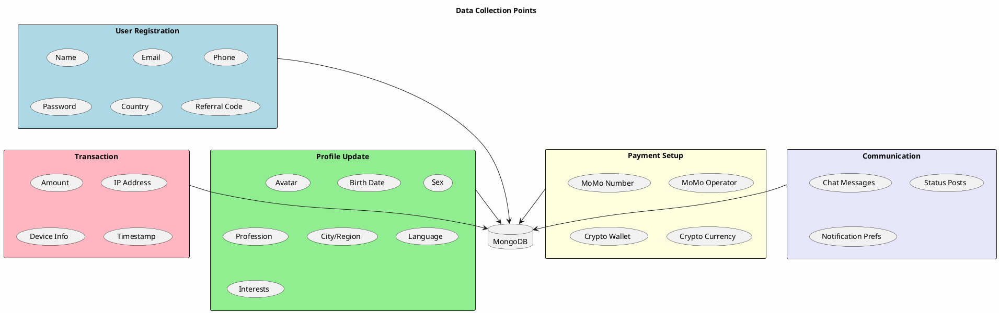
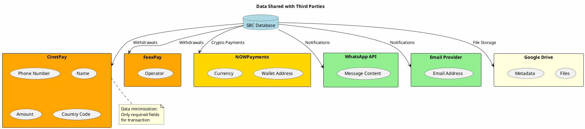

# SBC Backend - Security & Data Protection Audit Document

**Company:** Sniper Business Center (SBC)
**Document Version:** 1.0
**Date:** January 2026
**Prepared for:** Security Certification Audit

---

## Table of Contents

1. [Platform Overview](#1-platform-overview)
2. [Architecture Diagrams (PlantUML)](#2-architecture-diagrams-plantuml)
3. [Personal Data Inventory](#3-personal-data-inventory)
4. [Security Measures](#4-security-measures)
5. [Third-Party Services](#5-third-party-services)
6. [Data Flow Diagrams](#6-data-flow-diagrams)
7. [Access Control & Authentication](#7-access-control--authentication)
8. [Incident Response](#8-incident-response)
9. [User Rights & Data Management](#9-user-rights--data-management)

---

## 1. Platform Overview

### 1.1 Description
SBC (Sniper Business Center) is a web-based platform providing financial services including:
- User registration and profile management
- Mobile money payments and withdrawals
- Cryptocurrency transactions
- Referral system with commissions
- Tombola/lottery functionality
- Product marketplace
- Real-time chat and notifications

### 1.2 User Types
| Role | Description | Access Level |
|------|-------------|--------------|
| `user` | Regular platform user | Personal data, transactions |
| `admin` | Super administrator | Full system access |
| `withdrawal_admin` | Sub-administrator | Withdrawal approvals only |
| `tester` | Test accounts | Limited testing access |

### 1.3 Geographic Coverage
- **Primary Markets:** Cameroon (CM), Côte d'Ivoire (CI), Senegal (SN)
- **Supported Countries:** Togo, Benin, Mali, Burkina Faso, Guinea, Congo (RDC), Kenya
- **Currency:** XAF, XOF, KES, CDF, GNF

### 1.4 Active Users
- Platform accessible with authentication required for transactions
- Public pages: Landing, payment pages
- Protected pages: Dashboard, transactions, profile

---

## 2. Architecture Diagrams (PlantUML)

### 2.1 System Architecture Diagram

```plantuml
@startuml SBC_System_Architecture
!define RECTANGLE class

skinparam backgroundColor #FEFEFE
skinparam componentStyle rectangle
skinparam defaultFontSize 12
skinparam shadowing false

title SBC Microservices Architecture

' External Users
actor "Web User" as WebUser
actor "Mobile User" as MobileUser
actor "Admin" as Admin

' External Services
cloud "External Services" {
    [CinetPay API] as CinetPay #LightBlue
    [FeexPay API] as FeexPay #LightBlue
    [NOWPayments API] as NOWPayments #LightBlue
    [WhatsApp Cloud API] as WhatsApp #LightGreen
    [Twilio/QueenSMS] as SMS #LightGreen
    [SendGrid/SMTP] as Email #LightGreen
    [Google Drive API] as GDrive #LightYellow
}

' Infrastructure Layer
package "Infrastructure" {
    [Nginx Reverse Proxy] as Nginx #Orange
    database "MongoDB" as MongoDB #Green
    database "Redis" as Redis #Red
}

' Frontend Layer
package "Frontend Applications" {
    [User Web App\n(React/Vite)\nPort: 443] as UserApp #LightCyan
    [Admin Dashboard\n(React/Vite)\nPort: 3030] as AdminApp #LightCyan
}

' API Gateway Layer
package "API Gateway Layer" {
    [Gateway Service\nPort: 3000] as Gateway #Gold
}

' Microservices Layer
package "Core Microservices" {
    [User Service\nPort: 3001] as UserService #LightPink
    [Payment Service\nPort: 3003] as PaymentService #LightPink
    [Notification Service\nPort: 3002] as NotificationService #LightPink
}

package "Business Microservices" {
    [Product Service\nPort: 3004] as ProductService #Lavender
    [Advertising Service\nPort: 3005] as AdvertisingService #Lavender
    [Tombola Service\nPort: 3006] as TombolaService #Lavender
    [Settings Service\nPort: 3007] as SettingsService #Lavender
    [Chat Service\nPort: 3008] as ChatService #Lavender
}

' User Connections
WebUser --> Nginx
MobileUser --> Nginx
Admin --> Nginx

' Nginx to Frontend
Nginx --> UserApp
Nginx --> AdminApp

' Frontend to Gateway
UserApp --> Gateway : HTTPS
AdminApp --> Gateway : HTTPS

' Gateway to Services
Gateway --> UserService : HTTP
Gateway --> PaymentService : HTTP
Gateway --> NotificationService : HTTP
Gateway --> ProductService : HTTP
Gateway --> AdvertisingService : HTTP
Gateway --> TombolaService : HTTP
Gateway --> SettingsService : HTTP
Gateway --> ChatService : HTTP

' Services to Databases
UserService --> MongoDB : sbc_user_db
PaymentService --> MongoDB : sbc_payment_db
NotificationService --> MongoDB : sbc_notification_db
NotificationService --> Redis : Job Queue
ProductService --> MongoDB : sbc_product_db
AdvertisingService --> MongoDB : sbc_advertising_db
TombolaService --> MongoDB : sbc_tombola_db
SettingsService --> MongoDB : sbc_settings_db
ChatService --> MongoDB : sbc_chat_db

' External Service Connections
PaymentService --> CinetPay : HTTPS
PaymentService --> FeexPay : HTTPS
PaymentService --> NOWPayments : HTTPS
NotificationService --> WhatsApp : HTTPS
NotificationService --> SMS : HTTPS
NotificationService --> Email : SMTP/HTTPS
SettingsService --> GDrive : HTTPS

@enduml
```



### 2.2 Service Communication Diagram



### 2.3 Data Flow Diagram - User Registration



### 2.4 Data Flow Diagram - Payment/Withdrawal



### 2.5 Security Architecture Diagram



### 2.6 Deployment Architecture



---

## 3. Personal Data Inventory

### 3.1 User Profile Data

| Field | Type | Purpose | Retention | Encryption |
|-------|------|---------|-----------|------------|
| `name` | String | User identification | Account lifetime | At rest |
| `email` | String | Authentication, notifications | Account lifetime | At rest |
| `phoneNumber` | String | Authentication, payments | Account lifetime | At rest |
| `momoNumber` | String | Mobile money withdrawals | Account lifetime | At rest |
| `password` | String | Authentication | Account lifetime | Bcrypt hashed |
| `birthDate` | Date | Age verification | Account lifetime | At rest |
| `sex` | Enum | Demographics | Account lifetime | At rest |
| `profession` | String | Demographics | Account lifetime | At rest |
| `country` | String | Service localization | Account lifetime | At rest |
| `city` | String | Service localization | Account lifetime | At rest |
| `region` | String | Service localization | Account lifetime | At rest |
| `avatar` | URL | Profile display | Account lifetime | At rest |
| `cryptoWalletAddress` | String | Crypto withdrawals | Account lifetime | At rest |

### 3.2 Financial Data

| Field | Type | Purpose | Retention | Encryption |
|-------|------|---------|-----------|------------|
| `balance` | Number | Account balance | Account lifetime | At rest |
| `usdBalance` | Number | USD equivalent | Account lifetime | At rest |
| `debt` | Number | Outstanding debt | Until cleared | At rest |
| Transaction records | Document | Audit trail | 7 years | At rest |
| Payment intents | Document | Payment processing | 90 days | At rest |

### 3.3 Security & Authentication Data

| Field | Type | Purpose | Retention | Encryption |
|-------|------|---------|-----------|------------|
| `ipAddress` | String | Security, fraud prevention | 90 days | At rest |
| `ipCity/Region/Country` | String | Geolocation security | 90 days | At rest |
| OTP codes | String | 2FA verification | 10 minutes | At rest |
| `passwordResetToken` | String | Password recovery | 1 hour | At rest |
| JWT tokens | String | Session management | 24 hours | Signed |

### 3.4 Communication Data

| Field | Type | Purpose | Retention | Encryption |
|-------|------|---------|-----------|------------|
| Chat messages | String | User communication | Account lifetime | At rest |
| Notification history | Document | Delivery tracking | 90 days | At rest |
| Status updates | Document | Social features | 24 hours | At rest |

---

## 4. Security Measures

### 4.1 Authentication Security

| Measure | Implementation | Details |
|---------|----------------|---------|
| Password Hashing | bcrypt | 10 salt rounds, timing-safe comparison |
| JWT Tokens | jsonwebtoken | 24h expiration, HS256 algorithm |
| OTP Generation | crypto.randomBytes | 6-digit, 10-minute validity |
| Session Management | Stateless JWT | No server-side sessions |

### 4.2 Transport Security

| Measure | Implementation | Details |
|---------|----------------|---------|
| HTTPS | SSL/TLS | Let's Encrypt certificate |
| HSTS | Helmet middleware | Strict-Transport-Security header |
| Certificate Pinning | Not implemented | Recommended for mobile app |

### 4.3 Application Security

| Measure | Implementation | Details |
|---------|----------------|---------|
| Security Headers | Helmet.js | X-Frame-Options, X-XSS-Protection, CSP |
| CORS | cors middleware | Configured per service |
| Rate Limiting | express-rate-limit | Multiple tiers (strict/medium/general) |
| Input Validation | Custom middleware | Phone, email, amount validation |

### 4.4 Rate Limiting Configuration

| Limiter | Window | Max Requests | Applied To |
|---------|--------|--------------|------------|
| strictLimiter | 5 minutes | 10 | Login, OTP verification |
| mediumLimiter | 1 hour | 20 | Registration |
| generalLimiter | 15 minutes | 200 | Authenticated API calls |
| adminLimiter | 15 minutes | 500 | Admin operations |
| webhookLimiter | 1 minute | 60 | Payment webhooks |

### 4.5 Database Security

| Measure | Implementation | Details |
|---------|----------------|---------|
| Separate Databases | Per-service isolation | sbc_user_db, sbc_payment_db, etc. |
| Field Exclusion | Mongoose select: false | Passwords, OTPs excluded by default |
| Indexed Fields | Unique constraints | email, phoneNumber, referralCode |
| Connection Timeout | 60s server selection | Prevents hanging connections |

---

## 5. Third-Party Services

### 5.1 Payment Providers

| Provider | Type | Data Shared | Security |
|----------|------|-------------|----------|
| **CinetPay** | Mobile Money | Phone, name, amount, country | API Key + Password, IP whitelist |
| **FeexPay** | Mobile Money | Phone, amount, operator | Bearer Token, IP whitelist |
| **NOWPayments** | Cryptocurrency | Wallet address, amount | API Key, IPN signature verification |

### 5.2 Notification Providers

| Provider | Type | Data Shared | Security |
|----------|------|-------------|----------|
| **WhatsApp Cloud API** | Messaging | Phone number, message content | Access Token, webhook verification |
| **Twilio** | SMS | Phone number, message | Account SID + Auth Token |
| **QueenSMS** | SMS | Phone number, message | API Key |
| **SendGrid/SMTP** | Email | Email address, content | API Key / SMTP credentials |

### 5.3 Storage & Infrastructure

| Provider | Type | Data Shared | Security |
|----------|------|-------------|----------|
| **Google Drive** | File Storage | Files, metadata | Service Account JWT |
| **MongoDB** | Database | All application data | Local instance, network isolated |
| **Redis** | Cache/Queue | Session data, job queues | Password protected |

### 5.4 Third-Party Data Processing Agreements

| Provider | DPA Status | Data Location |
|----------|------------|---------------|
| CinetPay | Required | Africa (Côte d'Ivoire) |
| FeexPay | Required | Africa |
| NOWPayments | Required | International |
| WhatsApp/Meta | In place | International (US/EU) |
| Google | In place | International |

---

## 6. Data Flow Diagrams

### 6.1 Data Collection Points



### 6.2 Data Sharing with Third Parties



---

## 7. Access Control & Authentication

### 7.1 Role-Based Access Control (RBAC)

| Role | Permissions |
|------|-------------|
| `user` | Own profile, own transactions, chat, products |
| `admin` | All user permissions + all users, all transactions, system settings |
| `withdrawal_admin` | View/approve withdrawals only |
| `tester` | Limited testing environment access |

### 7.2 Service-to-Service Authentication

- **Method:** Bearer token in Authorization header
- **Secret:** Shared `SERVICE_SECRET` environment variable
- **Header:** `X-Service-Name` identifies calling service
- **Validation:** Constant-time comparison to prevent timing attacks

### 7.3 Admin Access Controls

| Control | Implementation |
|---------|----------------|
| Admin login | Same JWT flow with role verification |
| Admin actions | Role middleware checks `req.user.role` |
| Audit logging | Admin actions logged with userId and timestamp |
| IP restrictions | Can be configured via Nginx |

---

## 8. Incident Response

### 8.1 Detection Mechanisms

| Mechanism | Implementation |
|-----------|----------------|
| Rate limit violations | Logged and alerts possible |
| Failed login attempts | Logged with IP address |
| Invalid JWT tokens | Logged as authentication failures |
| Unusual transaction patterns | Manual review required |

### 8.2 Response Procedures

1. **Detection:** Automated logging of suspicious activity
2. **Assessment:** Review logs to determine scope
3. **Containment:** Block IPs, revoke tokens, disable accounts
4. **Notification:** Alert affected users within 72 hours (GDPR-like)
5. **Recovery:** Restore from backups if needed
6. **Post-mortem:** Document incident and improvements

### 8.3 Backup & Recovery

| Data | Backup Frequency | Retention | Recovery Time |
|------|------------------|-----------|---------------|
| MongoDB databases | Daily | 30 days | < 4 hours |
| Redis cache | Not backed up | Ephemeral | N/A |
| Configuration files | Version controlled | Indefinite | < 1 hour |

---

## 9. User Rights & Data Management

### 9.1 User Rights Implementation

| Right | Implementation | Endpoint |
|-------|----------------|----------|
| **Access** | User can view all personal data | GET /api/users/me |
| **Rectification** | User can update profile | PUT /api/users/me |
| **Erasure** | Soft delete (deleted: true) | DELETE /api/users/me |
| **Portability** | Export user data | GET /api/users/me/export |
| **Withdraw consent** | Update notification preferences | PUT /api/users/me/preferences |

### 9.2 Data Retention Policy

| Data Type | Retention Period | Deletion Method |
|-----------|------------------|-----------------|
| User accounts | Until deletion request | Soft delete, then hard delete after 30 days |
| Transactions | 7 years (legal requirement) | Archived after 2 years |
| Chat messages | Account lifetime | Deleted with account |
| Notifications | 90 days | Automatic purge |
| OTPs | 10 minutes | Automatic expiration |
| Password reset tokens | 1 hour | Automatic expiration |

### 9.3 Contact Information

| Purpose | Contact |
|---------|---------|
| Data Protection Inquiries | [To be defined] |
| Security Incidents | [To be defined] |
| General Support | [To be defined] |

---

## Appendix A: Environment Variables (Sensitive)

The following environment variables contain sensitive data and must be protected:

```
# Authentication
JWT_SECRET=************
SERVICE_SECRET=************

# Database
MONGODB_URI_PROD=************

# Payment Providers
CINETPAY_API_KEY=************
CINETPAY_SECRET_KEY=************
FEEXPAY_API_KEY=************
NOWPAYMENTS_API_KEY=************

# Notification Providers
WHATSAPP_ACCESS_TOKEN=************
TWILIO_AUTH_TOKEN=************
SENDGRID_API_KEY=************

# Storage
DRIVE_PRIVATE_KEY=************
```

---

## Appendix B: Compliance Checklist

| Requirement | Status | Notes |
|-------------|--------|-------|
| Data encryption at rest | ✅ | MongoDB encryption |
| Data encryption in transit | ✅ | HTTPS/TLS |
| Password hashing | ✅ | bcrypt, 10 rounds |
| Access logging | ✅ | Morgan + custom logging |
| Rate limiting | ✅ | Multiple tiers |
| Input validation | ✅ | Custom middleware |
| RBAC | ✅ | 4 roles defined |
| Security headers | ✅ | Helmet.js |
| Third-party DPAs | ⚠️ | In progress |
| Privacy policy | ⚠️ | To be published |
| Cookie consent | ⚠️ | Minimal cookie use |
| Data breach procedure | ⚠️ | Documented above |
| Regular security audits | ⚠️ | Recommended annually |

---

*Document prepared for security certification audit. All information accurate as of January 2026.*
